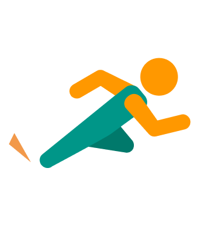

# Nice Run Club

## 製品概要
### ランニング x Tech

### 背景（製品開発のきっかけ、課題等）
運動不足を感じ、ランニングを始めるものの、モチベーションを保ち続けるのは難しく、習慣化するのは難しい。  
それを解決するためのシステムを何か作ることができないかと思い、開発を始めた。

### 製品説明（具体的な製品の説明）
* Nice Run Clubは、システム上で4人組を作り、1週間チームとして共にランニングを行う。
* ランニングアクティビティはGoogle Fitと連携し、システムに取り込むことができる。
* チームごとに設定された目標距離を達成できれば「レート」が増加し、達成できなければ「レート」が減少する。
* ユーザーごとのレートランキングもある。

### 特長

#### 1. 特長1
Nice Run Clubは、システム上で4人組を作り、1週間チームとして共にランニングを行う。

#### 2. 特長2
ランニングアクティビティはGoogle Fitと連携し、システムに取り取り込むことができる。

#### 3. 特長3
チームごとに設定された目標距離を達成できれば「レート」が増加し、達成できなければ「レート」が減少する。

### 解決出来ること
これまで始めてもすぐ辞めてしまっていたランニングを継続することができる。

### 今後の展望
今回は実現できなかったが、今後改善すること、どのように展開していくことが可能かについて記載をしてください。

## 開発内容・開発技術
### 活用した技術
#### API・データ
* Google Fit

#### フレームワーク・ライブラリ・モジュール
* Python(Flask)
* Firebase
* React

#### デザインツール
* Figma

#### デバイス
* お手持ちのスマートフォン

### 研究内容・事前開発プロダクト（任意）
ご自身やチームの研究内容や、事前に持ち込みをしたプロダクトがある場合は、こちらに実績なども含め記載をして下さい。

* 特に無し

### 独自開発技術（Hack Dayで開発したもの）
#### 2日間に開発した独自の機能・技術
* 全部
